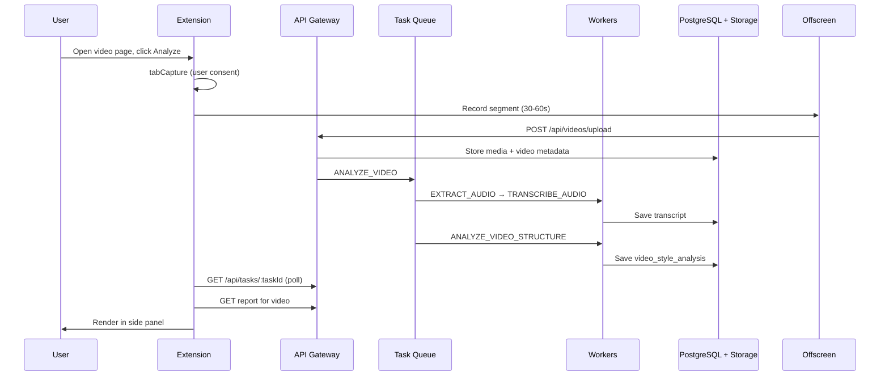
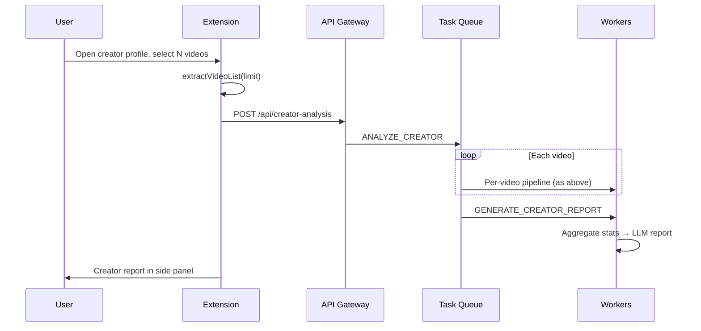

# Data Flow

## Single-Video Analysis (MVP Path)

## Creator Batch Analysis (Phase 2)

## Metadata Extraction (Browser-Side)

Collected from visible DOM / page context before capture:

- Platform, creator URL, display name, handle
- Video URL, title, description, cover
- Like / comment / collect counts (if visible)
- Publish time, duration (if available)

Sent to background → API as normalized `CreatorVideoMeta` / `CreatorProfile`.

## Worker Pipeline Stages

| Stage | Tooling | Stored in |
|-------|---------|-----------|
| Preprocess | ffmpeg | Object storage (temp) |
| ASR | Whisper / OpenAI STT | `transcripts` |
| Frame extract | ffmpeg (sparse fps) | Object storage |
| Vision | GPT/Gemini vision | `visual_analyses` |
| Structure | LLM + prompt | `video_style_analyses` |
| Report | LLM + aggregated stats | `creator_reports` |

## Progress Reporting

`GET /api/tasks/:taskId` returns:

- `status`, `progress` (0-100)
- `currentStep` (human-readable)
- `finishedVideos` / `totalVideos` for batch jobs

Extension polls or uses SSE/WebSocket (future) to update UI.

## Failure Points

| Failure | User-facing behavior |
|---------|---------------------|
| Unsupported platform | Explain supported sites |
| No videos found | Suggest scroll or manual selection |
| Tab capture denied | Instructions to grant permission |
| Upload failure | Retry with clear error |
| ASR / vision / LLM failure | Partial report or step retry |
| User cancel | Stop recording, cancel queued jobs |

See [AGENTS.md](../../AGENTS.md#error-handling) for full list.
