# Vision & Outcomes

## What CreatorDNA Is

A **creator style intelligence tool** for short-video platforms. It analyzes publicly visible content the user can already access in the browser and produces structured reports about how a creator builds content — not copies of their videos or scripts.

Supported platforms (long-term): Douyin Web, TikTok Web, YouTube Shorts, Bilibili, and similar web clients.

## Target Users

- Individual creators learning from successful accounts
- MCN teams analyzing creator style and strategy
- Brand teams evaluating creator fit
- Marketers and founders researching distribution patterns
- Content strategists studying hooks, structure, and visual patterns

## Report Outputs (Creator-Level)

The system should eventually surface:

| Dimension | Example output |
|-----------|----------------|
| Content positioning | "AI 创业方法论" |
| Topic patterns | Recurring categories and themes |
| Hook formulas | Opening sentence types and templates |
| Speaking style | Pace, tone, rhetorical patterns |
| Video structure | Hook → body → ending patterns |
| Shooting & editing | Talking head vs B-roll, rhythm |
| Subtitle & visual style | Position, typography, density |
| Reusable templates | Structural formulas, not verbatim scripts |
| Performance patterns | High vs low performer commonalities |

## Core User Flow

```mermaid
flowchart LR
  A[Open creator profile] --> B[Extension detects platform]
  B --> C[Extract visible metadata]
  C --> D[User selects sample size]
  D --> E[User starts analysis]
  E --> F[Per-video capture & upload]
  F --> G[Backend AI pipeline]
  G --> H[Video-level JSON analyses]
  H --> I[Creator-level aggregation]
  I --> J[Report in side panel / dashboard]
  J --> K[Export MD / PDF / JSON]
```

## V1 Scope (Production Launch)

V1 is **not** the minimal MVP alone — it is the full path to production on Douyin Web:

| Included | Excluded (Phase 5 post-launch) |
|----------|--------------------------------|
| Single-video analysis (Phase 1) | Multi-platform (TikTok, Bilibili, YouTube) |
| Creator batch 10–20 videos (Phase 2) | Team workspace |
| Visual / subtitle analysis (Phase 3) | Creator comparison |
| Export MD / JSON / PDF (Phase 4) | Web dashboard |
| Auth, CI, staging, store listing (Phase 6) | Brand-fit, opportunity discovery |

**Platform:** Douyin Web ([ADR 001](../architecture/decisions/001-mvp-platform-douyin.md))  
**Complete when:** [launch-criteria.md](./launch-criteria.md) satisfied and P6-18 done (56 tasks).

## MVP Definition (Phase 1 gate)

**First vertical slice** inside V1:

1. Douyin Web only
2. Creator profile detection + visible video list extraction (Phase 2 builds on this)
3. **Single-video** analysis via user-triggered tab capture
4. ASR on captured audio
5. Video-level structure analysis (hook, structure, speaking style)
6. Results in extension side panel

Creator-level batch aggregation comes **after** single-video E2E (P1-12).

## Success Criteria

### MVP is done when

- [ ] User on a supported creator/video page sees correct detection in the extension
- [ ] User can trigger capture on one video with explicit consent
- [ ] Audio is transcribed and structure analysis returns valid JSON
- [ ] Side panel shows a readable single-video report
- [ ] Failures (capture denied, ASR error, etc.) show clear user-facing errors
- [ ] No silent or background recording occurs

### V1 launch (all phases complete)

- [ ] All items in [launch-criteria.md](./launch-criteria.md)
- [ ] P6-18 Launch Review signed off

### Phase milestones

- Phase 1: Single-video E2E on Douyin (P1-12)
- Phase 2: Creator batch report (P2-08)
- Phase 3: Visual dimensions in reports (P3-06)
- Phase 4: Export MD/JSON/PDF (P4-06)
- Phase 6: Production launch (P6-18)

## Product Tone

- Technical, reliable, clean, serious, creator-friendly, compliance-aware
- Avoid: "copy this creator's exact style"
- Prefer: "learn structural patterns for original creation"

## Non-Goals

- Video downloading or piracy tooling
- Impersonation or script cloning
- Fragile headless crawling without user context
- Storing full source videos indefinitely
