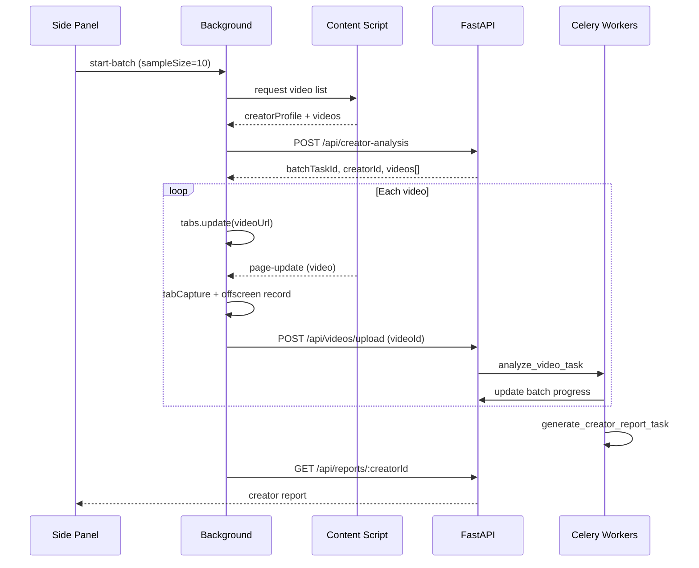

# Phase 2 — Creator Batch Analysis Implementation Plan

> **For agentic workers:** REQUIRED SUB-SKILL: Use superpowers:subagent-driven-development (recommended) or superpowers:executing-plans to implement this plan task-by-task. Steps use checkbox (`- [ ]`) syntax for tracking.

**Goal:** Analyze 10–20 Douyin videos from a creator profile page and produce an aggregated creator-level report.

**Architecture:** Extension extracts creator profile + video list from DOM, calls `POST /api/creator-analysis` to create creator/video stubs and a parent batch task, then sequentially navigates to each video for user-triggered tab capture and upload. Each upload enqueues `analyze_video_task`; on completion a callback updates batch progress. When all videos finish, `generate_creator_report_task` runs aggregation (stats only, no raw transcript dump) then LLM report generation.

**Tech Stack:** WXT extension, FastAPI, Celery, PostgreSQL, shared-types, packages/prompts

---

## Task 1: Database — `creator_analysis_tasks` (P2-03/P2-04)

**Files:**
- Create: `alembic/versions/003_creator_analysis_tasks.py`
- Create: `apps/api/db/models/creator_analysis_task.py`

- [ ] Add `creator_analysis_tasks` table: id, creator_id, status, progress, current_step, total_videos, finished_videos, error_code, error_message, timestamps
- [ ] Add nullable `creator_analysis_task_id` FK on `analysis_tasks`

---

## Task 2: API — Creator Analysis Service + Routes (P2-03)

**Files:**
- Create: `apps/api/schemas/creator.py`
- Create: `apps/api/services/creator.py`
- Create: `apps/api/routers/creators.py`
- Create: `apps/api/routers/reports.py`
- Modify: `apps/api/main.py`
- Modify: `apps/api/services/video.py` — support `videoId` + `creatorId` + `batchTaskId` on upload
- Modify: `apps/api/routers/videos.py`
- Modify: `apps/api/services/analysis.py` — unified task lookup (batch + single)

**Acceptance:** `POST /api/creator-analysis` returns taskId; douyin-only validation; `GET /api/reports/:creatorId` returns report.

---

## Task 3: Workers — Batch Progress + Aggregation + Report (P2-04/P2-05/P2-06)

**Files:**
- Create: `workers/services/aggregation.py`
- Create: `workers/services/report_generation.py`
- Create: `workers/tasks/analyze_creator.py`
- Modify: `workers/tasks/analyze_video.py` — call batch progress updater on completion
- Modify: `workers/celery_app.py`
- Modify: `packages/prompts/creator-report-generation.md`

---

## Task 4: Extension Adapter + Content Script (P2-01/P2-02)

**Files:**
- Modify: `apps/extension/platform-adapters/douyin-web.adapter.ts` — profile fields, scroll-to-load, richer video meta
- Modify: `apps/extension/entrypoints/content.ts` — publish creatorProfile + videoList on creator pages

---

## Task 5: Extension Batch Orchestration (P2-07)

**Files:**
- Modify: `apps/extension/lib/messages.ts` — batch session fields + messages
- Modify: `apps/extension/lib/api-client.ts` — createCreatorAnalysis, getCreatorReport
- Modify: `apps/extension/entrypoints/background.ts` — batch state machine, tab navigation loop
- Modify: `apps/extension/entrypoints/sidepanel/main.ts` — creator UI, sample size, batch progress, report view
- Modify: `apps/extension/entrypoints/sidepanel/style.css`

---

## Task 6: Tests + Docs (P2-08)

**Files:**
- Create: `tests/test_creator_analysis.py`
- Create: `tests/test_aggregation.py`
- Modify: `docs/tasks/BACKLOG.md`, `docs/STATUS.md`, `docs/tasks/phases/phase-2-creator-batch.md`
- Modify: `docs/api/schemas.md` if needed

---

## Batch Flow Diagram

